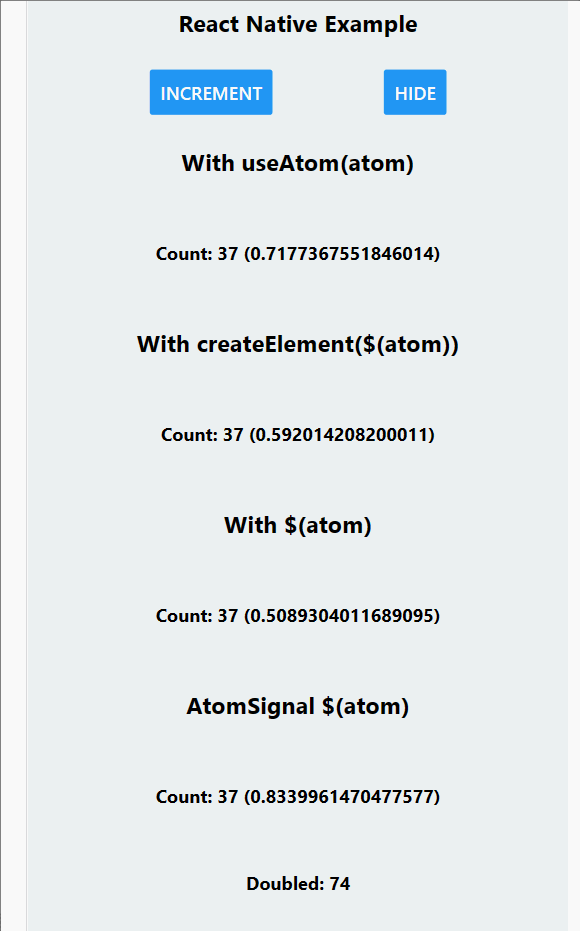

### React Native
### jotai/signals library

##### info
- [Demystifying Create React Signals Internals](https://blog.axlight.com/posts/demystifying-create-react-signals-internals/)

##### worked on
- [x] javascript (npx create-expo-app my-app)
- [x] typescript (sdk 48, npx create-expo-app --template)
- [x] web (thru react-native-web)
- [x] dev builds (https://docs.expo.dev/development/create-development-builds/)

##### todo
- [ ] preview mode (npx expo prebuild && npx expo run:android)

##### branches
	- master (typescript)
		- npx expo start --android
		- npx expo start --ios
	- web
		- npx expo start --web

##### online samples (by Mr. Daishi)
- https://snack.expo.dev/kjclneke1
- https://codesandbox.io/s/priceless-star-kg7dmh?file=/src/App.js

